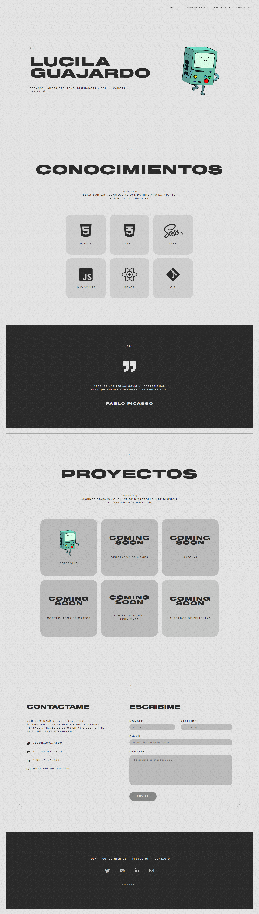

# Proyecto Portafolio Personal - (ES)

## Podés verlo haciendo click [acá.](https://lucilaguajardo.github.io/proyecto-portafolio-personal/)

## Contenidos

* [Descripción](#descripción)
* [Avances](#avances)
* [Tecnologías](#tecnologías)
* [Clonado](#clonado)
* [Dependencias](#dependencias)
* [Agradecimientos](#agradecimientos)

### Descripción

Este es el primer proyecto del **Curso de Desarrollo Front-End de Ada** y pertenece al *Módulo 1: Introducción a HTML y CSS*. En él se ven reflejados los conocimientos que adquirí hasta la fecha. Quiero crecer como desarrolladora y por eso el feedback siempre es muy bienvenido.

### Avances

### Tecnologías

* HTML5
* CSS3

### Clonado

Si querés tener una copia de este repositorio seguí los siguientes pasos:

  - En la página principal de este repositorio, clickeá el botón verde llamado **Code**.
  - En la sección *Clone with HTTPS*, copiá la **URL** que está debajo.
  - Después, en tu dispositivo local, abrí la terminal de bash y cambiá tu directorio actual y activo por la ubicación en la que quieras clonar el repositorio. Usá el comando de bash `cd` para ingresar a carpetas.
  - Una vez que navegaste hasta el directorio donde querés poner el repositorio, ingresá `git clone` y pegá la URL que copiaste anteriormente justo al lado.
  - Una vez que ejecutaste este comando, deberías tener una copia de este repositorio en tu computadora.

### Dependencias

Este proyecto no requiere la instalación de ninguna dependencia por el momento.

### Agradecimientos

* A [Jonh](https://github.com/Jonhks) y [Leydy](https://github.com/leydyk93)
* A mi familia y amigos
---

# Personal Portfolio Project - (EN)

## You can check it out by clicking [here.](https://lucilaguajardo.github.io/proyecto-portafolio-personal/)

## Contents

* [Description](#description)
* [Technologies](#technologies)
* [Cloning](#cloning)
* [Dependencies](#dependencies)
* [Thanks](#thanks)

### Description

This is the first project from **Ada's Front-End Development Course** and it belongs to *Module 1: Introduction to HTML and CSS*. It reflects all the skills I acquired till date. I want to grow as a developer and that's why feedback is always very much welcomed.

### Technologies

* HTML5
* CSS3

### Cloning

If you want to get a copy of this repository follow these steps:

  - On the main page of this repository, click on the green button labeled as **Code**. 
  - In the *Clone with HTTPS* section, copy the **URL** bellow.
  - Then, on your local device, open your bash shell and change your current working directory to the location where you would like to clone your repository. Use the bash command `cd` to enter folders.
  - Once you have navigated to the directory where you want to put your repository, enter `git clone` and paste the URL you copied earlier right next to that.
  - After you ran this command, you should now have a copy of this repository in your local computer.

### Dependencies

This project does not require the installation of any dependencies at the moment.

### Thanks

* To [Jonh](https://github.com/Jonhks) and [Leydy](https://github.com/leydyk93)
* To my family and friends